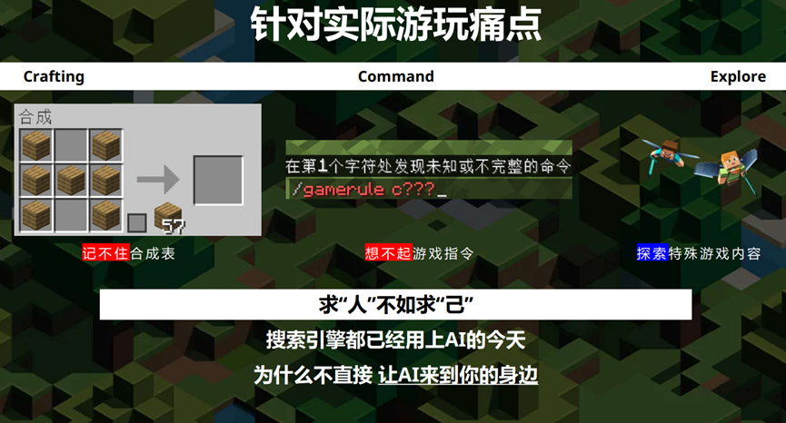
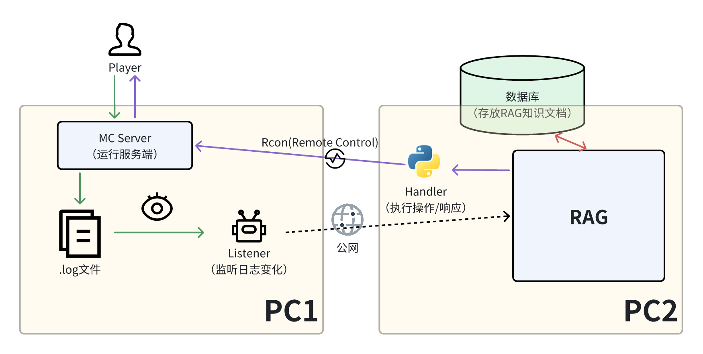
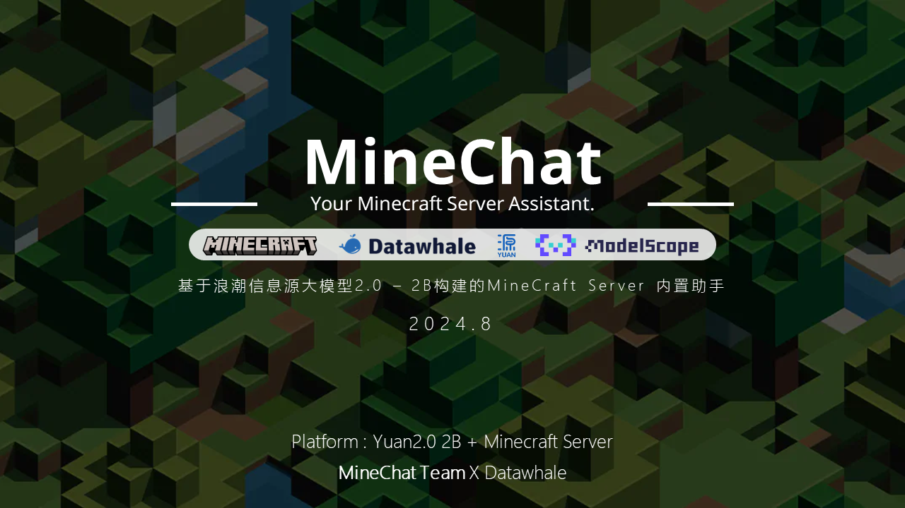

# MineChat 食用教程

MineChat 是一款基于大模型 RAG 技术实现的针对游戏 Minecraft（多人模式）游玩辅助插件。

> Minecraft 由 Mojang Studio 开发，是一款以探索、生存、创造为主题的自由沙盒游戏，它有着丰富精彩的游戏内容，也因此获得了业内的广泛好评和庞大的游戏群体。

MineChat 的诞生启发自我个人的游玩体验：记不住繁琐的合成表、不熟悉新版本的游戏内容、用不好游戏内的指令。在大模型逐渐流行的今天，我开始发现在 Minecraft 中也能像钢铁侠一样拥有一个实时助手“贾维斯”的可能性——于是 MineChat 来了。



> 我们的项目主页：https://github.com/XDUcy/MineChat/

接下来，我来带领大家重温整个插件的实现思路和流程。

# 1. 确定方向

和常规的大模型 Chatbot 类应用不同，我所设想的插件形式是内置于游戏中、无需单独切换到其他页面的，因此，最重要的就是考虑这种实现方法的技术可行性和具体途径。

既然是聊天，当然需要一个“聊天框”，幸运的是，游戏本身就有这一功能，一个直观的思路是：如果能够捕获聊天窗口中的内容，那么与大模型进行互动就是顺其自然的了。

经过斟酌实现难度后，我们选择首先针对服务端去做这一任务，原因有如下几点：

1. 服务端有对游戏内容随时记录更新且显式存储的 log，便于程序监控“谁说了什么”。

2. 以外置方式存在的服务端插件可以忽略很多隐藏的依赖问题，且对版本也不敏感。

3. 经过调研，服务端有开放的 RCON(Remote Control)协议可以用于程序信息互通。

至此，我们第一阶段的实现方向已经非常明确，设计一种外置于游戏体系的大模型对话机制，它大概有三个部分组成：

1. 信息监听模块：监控 Minecraft 服务器日志文件的更新，实时捕捉玩家的提问信息。

2. 问答处理模块：结合大模型输出与预设的知识库，通过合理的 Prompt 设计优化模型回答的准确性和相关性。

3. 命令处理模块：使用 RCON 协议与 Minecraft 服务器交互，发送命令并读取响应，确保 MineChat 能够及时反馈玩家提问。



# 2. Listener 信息监听部分

首先，我们先看看如何能够让大模型能“看到”大家在聊什么。经过本地测试可以发现，所有玩家的聊天/命令内容都会在服务端目录下的`./logs/latest.log`文件中记录，其内容如下：

```
... Server Info ...
[11:36:06] [Server thread/INFO]: <Sorobot> Hi Everyone!
... Other Info ...
```

关注玩家信息部分，可以抽象出格式`[time] [tag] <id> {contents}`，借用正则表达式，就能提取出其中的玩家信息字典条目`id: contents`。

```python
res := re.search(": <(.+)>(.+)", line):

# 正则匹配出的格式： res.group1 玩家名, res.group2 内容
```

解决了如何看懂的问题并没有完全实现这一模块，还有一个关键的问题需要思考——什么时候看？

最朴素的思想，既然不知道什么时候看最好，那就一直看好了。这也正是我们实现的思路，通过一个无限的死循环，Listener 将不断尝试从 Log 中读取新的一行，一旦读取成功，就将它处理并输送给后续模块。

```python
while True:
    line = self.fp.readline()
    if not line:
        time.sleep(1)
    else:
        pass
```

至此，我们完成了 Listener 的基本功能设计与实现，为了结构清晰，把它整合为一个类。（见`listener.py`）

# 3. 问答处理部分

这部分内容相信大家都很熟悉，既然我们已经拿到了用户信息，只需要将它经过编码（或再预先做一次 RAG 查询，与召回信息一起）后发送给大模型，等待它响应即可。

什么？你说你还不熟悉这个流程？

那还不快去学习 **Self-llm: 开源大模型食用指南** ！

# 4. 命令处理模块

我们离实现项目的最小化模型只差最后一步了：怎么把大模型的响应传入游戏？

这时候回顾一下我们选择服务端作为第一阶段开发对象的原因：它不仅有着 Log 存储方便提取信息，还可以开放一个供远程控制的 RCON 端口协议，只要能够通过 python 与之联系，就能自然地将信息由此传递！

所幸，前人给了我们一个肩膀可站。通过`pip install mcrcon`后，只需要实例化一个`MCRcon`对象就可以完成连接，接下来就能够通过对象与服务器互动了！

```python
! pip install mcrcon
... other imports ...
from mcrcon import MCRcon

... other codes ...
self.rcon = MCRcon(server_ip, password, port=25575) # 其中，服务器ip、rcon密码、开放端口都由服务端设置
... other codes ...
response = "I'm MineChat!"

self.rcon.command(f"/say {response}"") # rcon通过 /say 命令发送内容
```

# 5. 看看效果

恭喜！你已经完全领略了 MineChat 的实现思路。当然，为了叙述简便，我过程中忽略了很多诸如数据处理、线程同步等的次要内容，旨在让大家更专注实现思路，希望对你能有所启发。

兴趣是最好的老师，在动手实践过程中踩的每一个坑都是我们宝贵的经验。

MineChat 诞生于 Datawhale 2024 暑期夏令营，也获得了一些认可和鼓励，非常感谢一路上为我们提供帮助和建议的人们，希望未来还可以继续更新。



-   浪潮信息“源”大模型 AI 夏令营 最佳应用奖
-   2024 Datawhale AI 夏令营第四期 优秀作品奖

# MineChat 团队成员

-   张成昱
-   杨江琦琦
-   钟润柯
-   王子萌
-   周子轩
