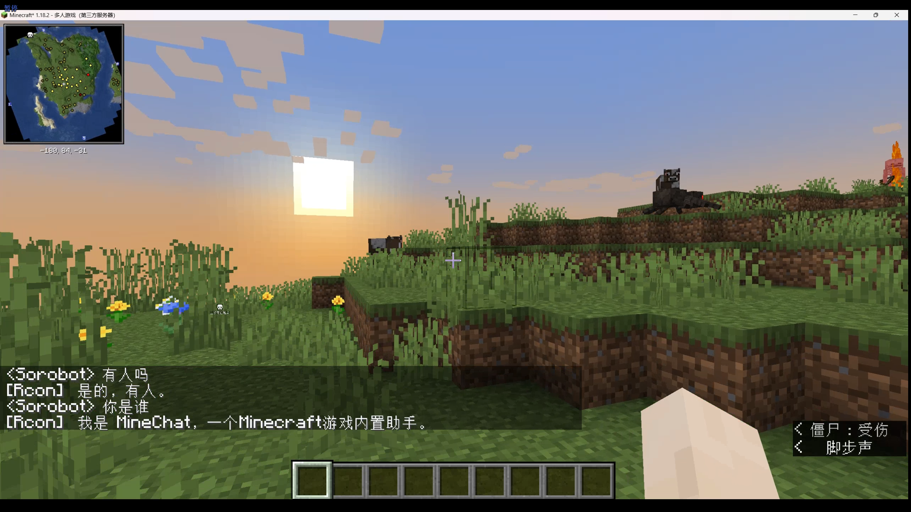

# MineChat demo1.0 - MineCraft Server 内置助手

-   你是否孤独游玩 Minecraft 无人交流？
-   你是否遇到游戏问题还要切屏搜索？
-   你是否苦于游戏命令根本记不清楚？

**尝试 MineChat！**它将成为你服务器游玩中的超级伙伴，随时随地帮你解决各种问题！

#

Powered by: 浪潮信息源大模型-2.0 2B + Datawhale 暑期夏令营第四期

—— MineChat 团队

# 部署指南

目前 MineChat 仅支持在服务端部署，需要服务端具有本地部署大模型条件。

> requirements: Python, Langchain, Chroma, MC Server

1. 在`config.json`中修改服务器的 log 文件路径和本地大模型/embed 模型文件夹
2. （可选）将服务器相关文档放于`./dataset`文件夹中，支持 pdf, txt 文件
3. 修改服务器`server.properties`中`rcon`相关配置，rcon 端口号和密码在`main.py`中修改一致
4. 配置`main.py`中的服务器 ip 地址，运行。等待部署完毕，游戏中即可进行互动。
